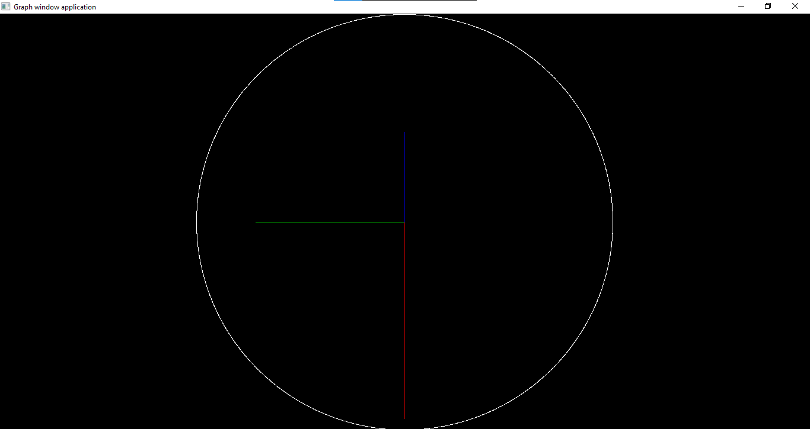

# Analog Clock in Pascal

## Overview

This Pascal program creates an analog clock with hour, minute, and second hands. It utilizes the `graph` unit for graphical output and provides a simple clock interface.

## Features

-   Analog clock display.
-   Hour, minute, and second hands.
-   Adjustable time intervals.

## Getting Started

### Prerequisites

Before running the program, ensure that you have a Pascal compiler that supports the `graph` unit.

### Usage

1. Copy the program code into your Pascal environment.
2. Compile and run the program.

## Program Structure

The program is structured as follows:

-   `sekundovaRucicka`, `minutovaRucicka`, `hodinovaRucicka`: Procedures for drawing and erasing clock hands.
-   `uloha_hodiny`: Main function for handling the clock display and time intervals.

## Screenshots

## Customization

Adjust the time intervals or colors by modifying the appropriate parameters in the code.

## License

This project is licensed under the MIT License - see the [LICENSE](LICENSE) file for details.
